# COLOR_CONVERSIONS_OF-IMAGE
## AIM
To write a python program using OpenCV to do the following image manipulations.

i) Read, display, and write an image.

ii) Access the rows and columns in an image.

iii) Cut and paste a small portion of the image.

iv)To perform the color conversion between RGB, BGR, HSV, and YCbCr color models.


## Software Required:
Anaconda - Python 3.7
## Algorithm:
### Step1:
Choose an image and save it as a filename.jpg ,
### Step2:
Use imread(filename, flags) to read the file.
### Step3:
Use imshow(window_name, image) to display the image.
### Step4:
Use imwrite(filename, image) to write the image.
### Step5:
End the program and close the output image windows.
### Step6:
Convert BGR and RGB to HSV and GRAY
### Step7:
Convert HSV to RGB and BGR
### Step8:
Convert RGB and BGR to YCrCb
### Step9:
Split and Merge RGB Image
### Step10:
Split and merge HSV Image

## Program:
### Developed By: ANISH RAJ P
### Register Number: 212222230010
## Output:

### i) Read and display the image
```
import cv2
import numpy as np
img=cv2.imread("my.jpg")
cv2.imshow("Mypic",img)
cv2.waitKey(0)
```
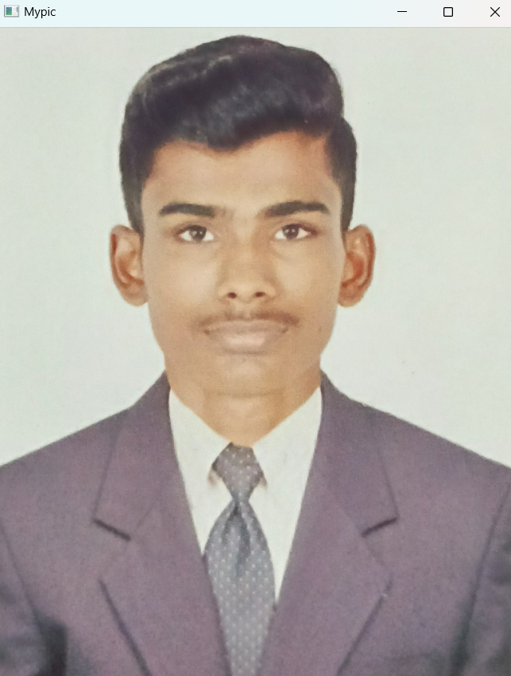

### ii)Write the image
```
import cv2
img=cv2.imread('my.jpg')
cv2.imwrite('Mypic1.jpg',img)
```
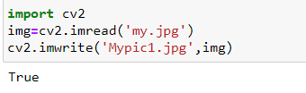

### iii)Shape of the Image
```
import cv2
img=cv2.imread('my.jpg')
print(img.shape)
```
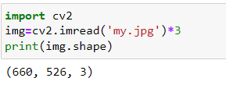

### iv)Access rows and columns
```
import cv2
import random
img=cv2.imread('my.jpg')
for i in range(150,200):
    for j in range(img.shape[1]):
        img[i][j]=[random.randint(0,255),
                  random.randint(0,255),
                  random.randint(0,255)]
cv2.imshow('Mypic',img)
cv2.waitKey(0)
cv2.destroyAllWindows()
```
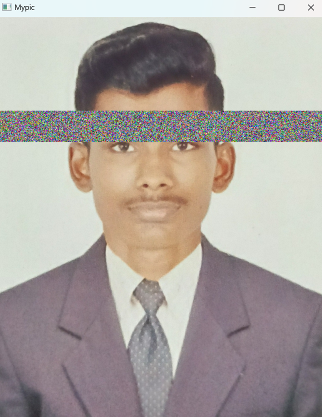

### v)Cut and paste portion of image
```
import cv2
img=cv2.imread('my.jpg')
tag=img[150:200,110:160]
img[110:160,150:200]=tag
cv2.imshow('Mypic',img)
cv2.waitKey(0)
cv2.destroyAllWindows()
```
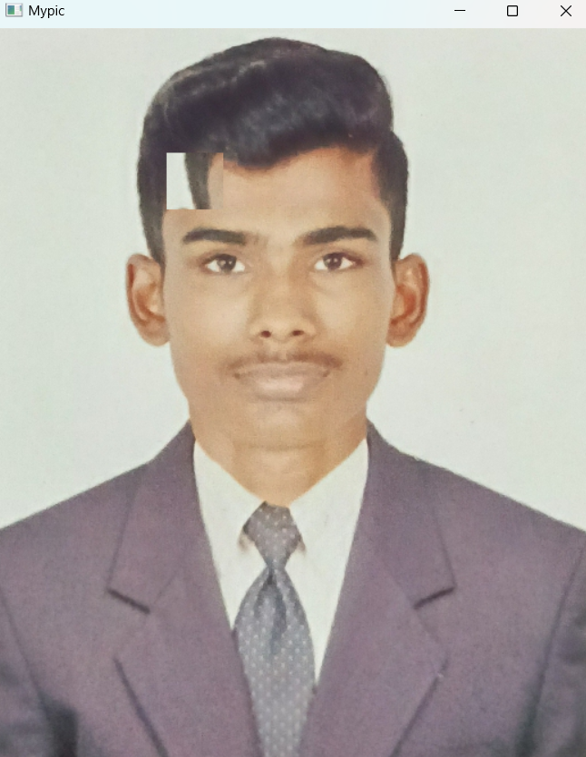

### vi) BGR and RGB to HSV and GRAY
```
import cv2
img = cv2.imread('my.jpg',1)
cv2.imshow('Mypic',img)

hsv1 = cv2.cvtColor(img,cv2.COLOR_BGR2HSV)
cv2.imshow('BGR2HSV',hsv1)

hsv2 = cv2.cvtColor(img,cv2.COLOR_RGB2HSV)
cv2.imshow('RGB2HSV',hsv2)

gray1 = cv2.cvtColor(img,cv2.COLOR_BGR2GRAY)
cv2.imshow('BGR2GRAY',gray1)

gray2 = cv2.cvtColor(img,cv2.COLOR_RGB2GRAY)
cv2.imshow('RGB2GRAY',gray2)

cv2.waitKey(0)
cv2.destroyAllWindows()
```
 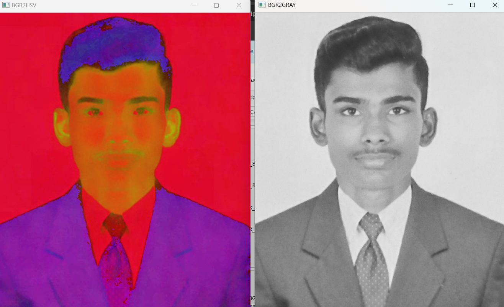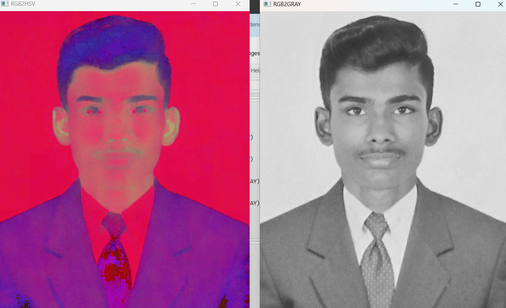

### vii) HSV to RGB and BGR
```
import cv2
img = cv2.imread('my.jpg')

img = cv2.cvtColor(img,cv2.COLOR_BGR2HSV)
cv2.imshow('Original HSV Image',img)

RGB = cv2.cvtColor(img,cv2.COLOR_HSV2RGB)
cv2.imshow('2HSV2BGR',RGB)

BGR = cv2.cvtColor(img,cv2.COLOR_HSV2BGR)
cv2.imshow('HSV2RGB',BGR)

cv2.waitKey(0)
cv2.destroyAllWindows()
```

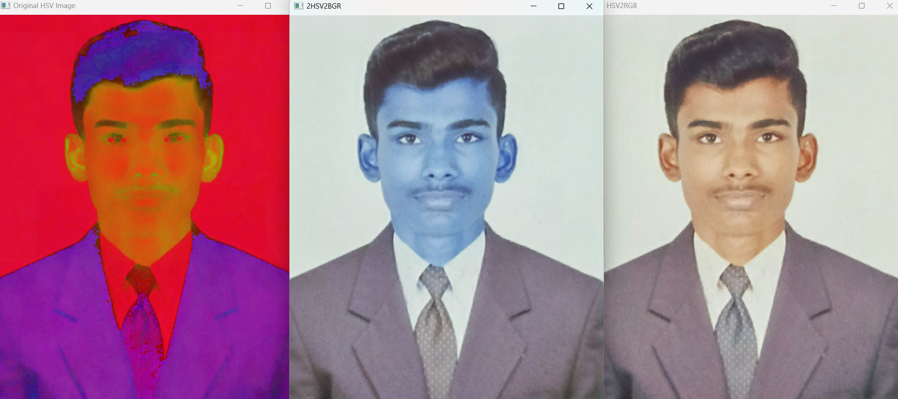

### viii) RGB and BGR to YCrCb
```
import cv2
img = cv2.imread('my.jpg')
cv2.imshow('Original RGB Image',img)

YCrCb1 = cv2.cvtColor(img, cv2.COLOR_BGR2YCrCb)
cv2.imshow('RGB-2-YCrCb',YCrCb1)

YCrCb2 = cv2.cvtColor(img, cv2.COLOR_RGB2YCrCb)
cv2.imshow('BGR-2-YCrCb',YCrCb2)

cv2.waitKey(0)
cv2.destroyAllWindows()
```
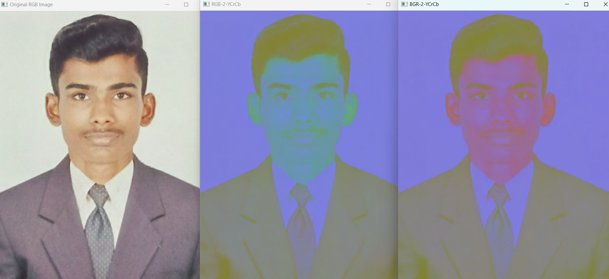

### ix) Split and merge RGB Image
```
import cv2
img = cv2.imread('my.jpg')

R = img[:,:,2]
G = img[:,:,1]
B = img[:,:,0]

cv2.imshow('R-Channel',R)
cv2.imshow('G-Channel',G)
cv2.imshow('B-Channel',B)

merged = cv2.merge((B,G,R))
cv2.imshow('Merged RGB image',merged)

cv2.waitKey(0)
cv2.destroyAllWindows()
```
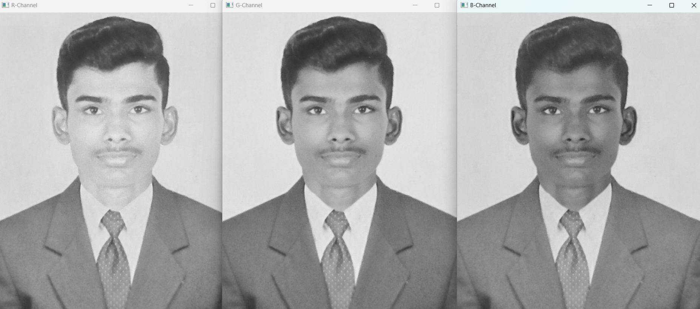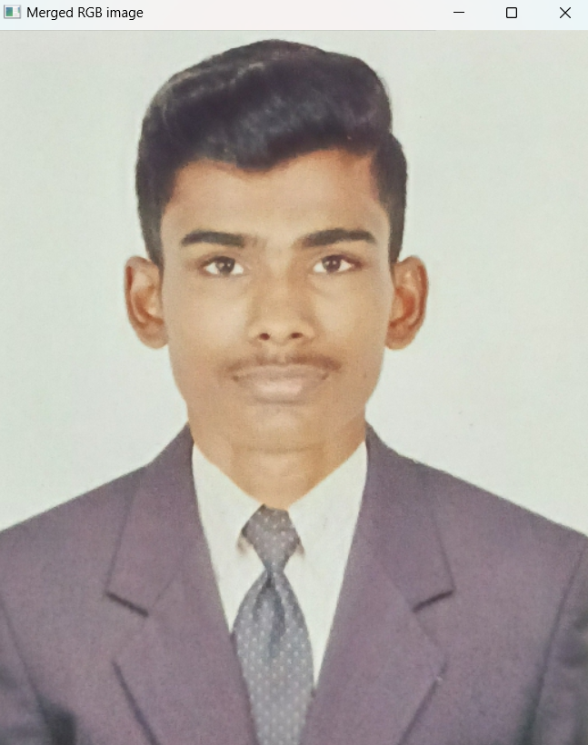

### x) Split and merge HSV Image
```
import cv2
img = cv2.imread("my.jpg")
img = cv2.resize(img,(400,400))
img=cv2.cvtColor(img,cv2.COLOR_RGB2HSV)

H,S,V=cv2.split(img)

cv2.imshow('Hue',H)
cv2.imshow('Saturation',S)
cv2.imshow('Value',V)

merged = cv2.merge((H,S,V))
cv2.imshow('Merged',merged)

cv2.waitKey(0)
cv2.destroyAllWindows()
```
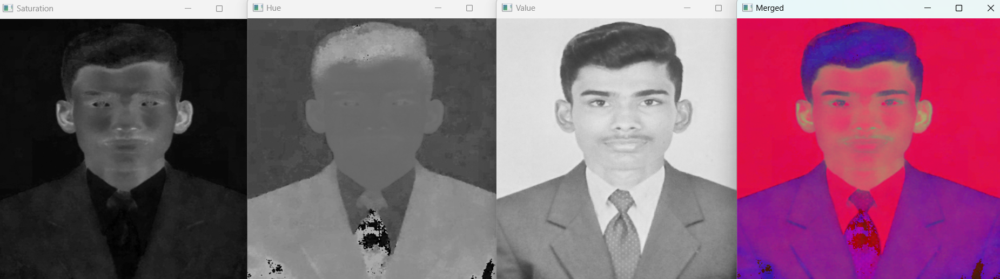

## Result:
Thus the images are read, displayed, and written ,and color conversion was performed between RGB, HSV and YCbCr color models successfully using the python program.


